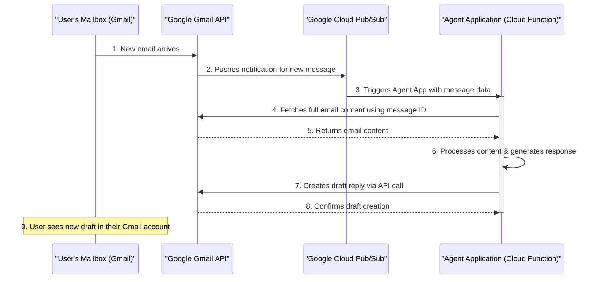

# Agent-Assisted Email Architecture

This document outlines the architecture for an email processing agent that automatically drafts responses to incoming emails.

The system is designed for a tight integration with Gmail, leveraging Google Cloud Pub/Sub for real-time, event-driven processing.

## Architectural Diagram

The following diagram illustrates the flow of data from the initial email receipt to the final draft creation.

## Components

1.  **User's Mailbox (Gmail)**
    *   **Responsibility:** The user's primary email account and the source of incoming emails.
    *   **Configuration:** The user grants permission for the application to access their mailbox via OAuth 2.0. No complex email forwarding rules are necessary.

2.  **Google Cloud Pub/Sub**
    *   **Responsibility:** A real-time messaging service that decouples the Gmail API from the Agent Application.
    *   **Function:** It receives push notifications from the Gmail API whenever a new email arrives in the user's mailbox. It then pushes this notification to the Agent Application, triggering it to run.

3.  **Agent Application (e.g., Cloud Function)**
    *   **Responsibility:** The core logic of the system.
    *   **Function:** It is subscribed to the Pub/Sub topic. When triggered by a notification, it uses the message ID from the notification to fetch the full email content from the Gmail API. It then processes the data, applies custom logic (e.g., calling an LLM), and generates the text for a response.

4.  **Google Gmail API**
    *   **Responsibility:** The primary interface for interacting with the user's mailbox.
    *   **Function:**
        *   **Push Notifications:** It is configured to watch the user's mailbox (`watch()`) and send notifications to Pub/Sub on new email events.
        *   **Data Retrieval:** It provides endpoints for the Agent Application to fetch email content.
        *   **Draft Creation:** It allows the Agent Application to create a new draft in the user's account. Authentication is handled securely via the OAuth 2.0 protocol, requiring one-time user consent.
