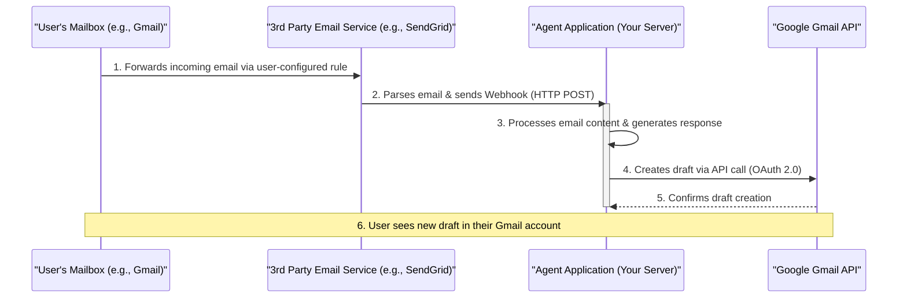

# Agent-Assisted Email Architecture

This document outlines the architecture for an email processing agent that automatically drafts responses to incoming emails.

The system is designed to be provider-agnostic by leveraging universal email forwarding and standard web technologies. It prioritizes real-time processing and simplicity of the core application logic.

## Architectural Diagram

The following diagram illustrates the flow of data from the initial email receipt to the final draft creation.

## Components

1.  **User's Mailbox (e.g., Gmail, Outlook)**
    *   **Responsibility:** The user's primary email account.
    *   **Configuration:** A forwarding rule is set up to automatically forward specific (or all) incoming emails to an address provided by the Webhook Service.

2.  **Third-Party Email Service (e.g., SendGrid, Mailgun)**
    *   **Responsibility:** Ingesting emails and converting them into machine-readable webhooks.
    *   **Function:** It provides a dedicated email address. When an email arrives, the service parses its content (sender, subject, body, attachments) into a structured JSON object and sends it as an HTTP POST request to a pre-configured URL.

3.  **Agent Application (Your Server)**
    *   **Responsibility:** The core logic of the system.
    *   **Function:** It exposes a secure API endpoint to receive the webhook from the email service. Upon receiving a request, it processes the email data, applies custom logic (e.g., calling an LLM), and generates the text for a response.

4.  **Google Gmail API**
    *   **Responsibility:** Interacting with the user's Gmail account programmatically.
    *   **Function:** The Agent Application uses the Gmail API to create a new draft in the user's account. Authentication is handled securely via the OAuth 2.0 protocol, requiring one-time user consent.
