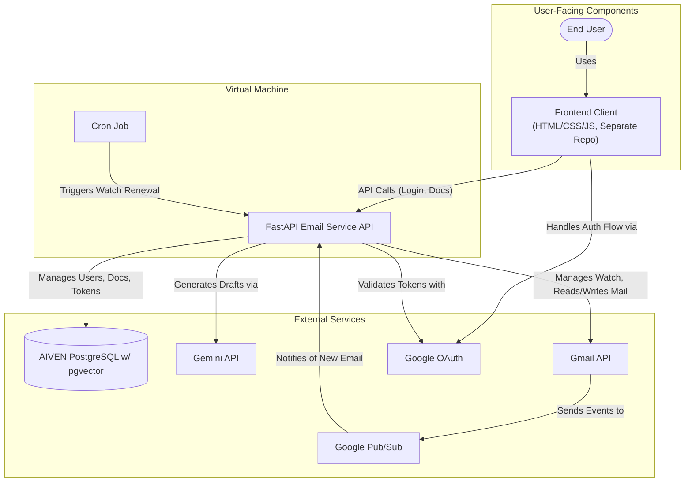

# System Architecture

Here is the high-level architecture for the agent-email service.

```mermaid
graph TD
    subgraph "User-Facing Components"
        User([End User])
        FrontendClient["Frontend Client\n(HTML/CSS/JS, Separate Repo)"]
    end

    subgraph "Virtual Machine"
        EmailService["FastAPI Email Service API"]
        CronJob["Cron Job"]
    end

    subgraph "External Services"
        AivenDB[("AIVEN PostgreSQL w/ pgvector")]
        Gemini["Gemini API"]
        GmailAPI["Gmail API"]
        PubSub["Google Pub/Sub"]
        OAuth["Google OAuth"]
    end

    %% --- High-Level Relationships ---

    User -- "Uses" --> FrontendClient
    FrontendClient -- "API Calls (Login, Docs)" --> EmailService
    FrontendClient -- "Handles Auth Flow via" --> OAuth

    EmailService -- "Validates Tokens with" --> OAuth
    EmailService -- "Manages Users, Docs, Tokens" --> AivenDB
    EmailService -- "Manages Watch, Reads/Writes Mail" --> GmailAPI
    EmailService -- "Generates Drafts via" --> Gemini

    CronJob -- "Triggers Watch Renewal" --> EmailService
    PubSub -- "Notifies of New Email" --> EmailService
    GmailAPI -- "Sends Events to" --> PubSub
```
