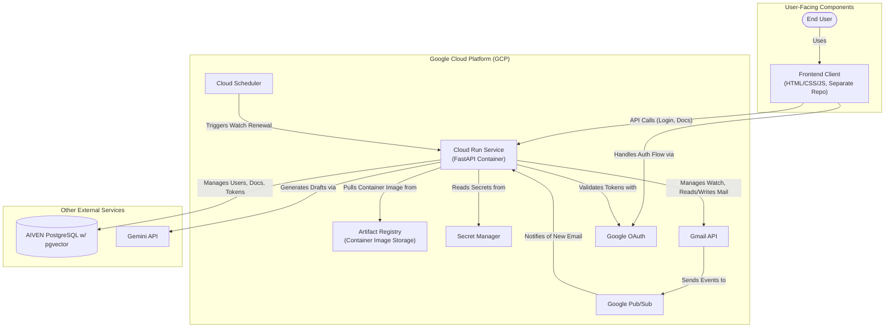

# System Architecture

This document outlines the high-level, serverless architecture for the agent-email service deployed on Google Cloud.

## Component Overview

-   **Frontend Client**: A user-facing web application (maintained in a separate repository) that handles user interaction, including the Google OAuth login flow and document management.

-   **Google Cloud Run**: The core of the backend is a containerized FastAPI application deployed as a serverless service on Cloud Run. This provides a scalable, managed compute environment that automatically handles incoming API requests from the frontend, as well as webhook notifications from Pub/Sub and Cloud Scheduler.

-   **AIVEN PostgreSQL**: A managed PostgreSQL database with the `pgvector` extension. It securely stores user information, encrypted refresh tokens, and the vector embeddings for all documents in the knowledge base.

-   **Google Pub/Sub**: Acts as the messaging backbone for asynchronous event handling. The Gmail API publishes a message to a Pub/Sub topic whenever a user's inbox changes. Cloud Run subscribes to this topic, ensuring that new emails are processed promptly without blocking other operations.

-   **Google Cloud Scheduler**: A fully managed cron job service used to ensure the application maintains access to user inboxes. It is configured to trigger the `/tasks/renew-gmail-watch` endpoint on the Cloud Run service once a day, renewing the notification subscription for every user.

-   **Secret Manager**: Securely stores all sensitive credentials, such as API keys and database passwords. The Cloud Run service is granted specific IAM permissions to access these secrets at runtime, avoiding the need to store them in the container image or environment variables directly.

-   **Gmail API & OAuth**: Used for all interactions with a user's mailbox. The OAuth 2.0 flow allows the application to obtain secure, user-consented access. The API is used to read new emails, save draft replies, and manage the "watch" notification subscription.

-   **Gemini API**: The generative AI service that provides the intelligence for the application. It takes the content of an incoming email and the most relevant documents from the user's knowledge base to generate a context-aware draft reply.
